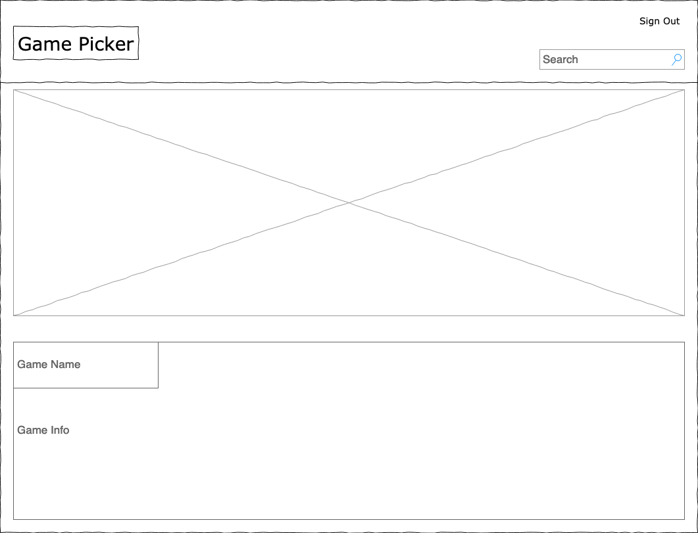
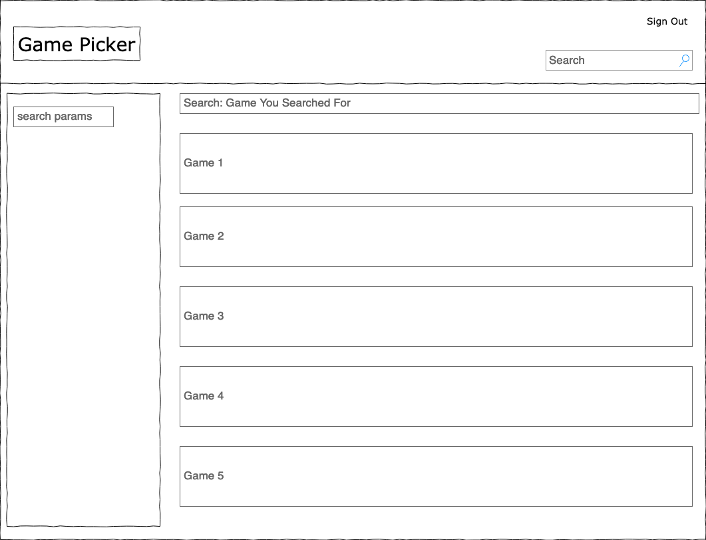
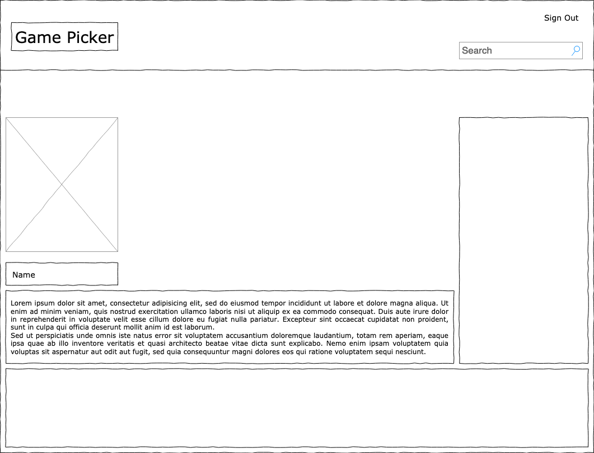
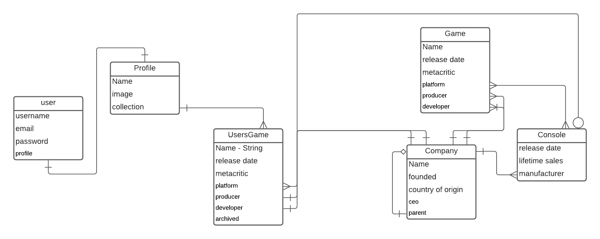

## Game Picker
Game Picker is a game cataloging site with the ability to pick a game for you to play.

## User Stories
Users will create an account

Users will search for games they own

Users will add games to their personal list of games

Users can click a randomize button to pick a game for them

(Stretch Goals)

Users can search using filters

Users can use filters with their randomizer

Users will be able to add other users as friends

After picking a game with randomizer users will be able to invite other friends who own the game to play with them.

## WireFrames

## ERD

## Technologies Used
React, JavaScript, CSS, JSX,  MongDB, Express, Auth0
